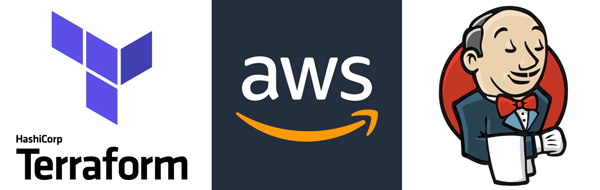
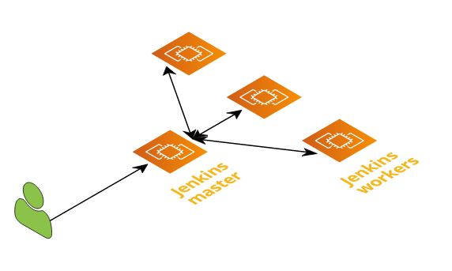

This code will create:
======================

- **Jenkins master instance**
- **Jenkins Windows slave (worker) instances**
- **VPC**
- **Security group**
- **Hosted Zone record**

Overview:
---------

Jenkins is a self-contained, open source automation server which can be used to automate all sorts of tasks related to building, testing, and delivering or deploying software.
For more info on Jenkins please visit its official webpage: https://jenkins.com/

Terraform script:
-----------------

This will create one Jenkins Master server and your wanted number of Windows slave instances (default value is 0). It will also set up all of the needed infrastructure - VPC and all within the VPC itself (subnets, routing table etc.) needed for supporting the servers.

SSH access key will be created for the instance and provided as a file in the root folder.
Easy connection link to the instance is generated for you to access it over SSH as output in the terminal when the Terraform completes setting up the infrastructure. Also a file: Login.txt will be created at the root folder with the link to access the instance over SSH.

To make things easier Jenkins will boot up with the initial admin account defined as: "administrator" for username, and "topsecretpassword" for its password. After setting up Jenkins (installing plugins etc.) make sure to change mentioned credentials.

For security reasons access to the instances will be only limited to the public IP of the workstation that you have started the Terraform script from. Keep in mind that the security group needs to be changed to allow access from other IP addresses.

DNS record will be created for the master instance pointing to the instance IP (default value is: jenkins.example.com). Please be patient and wait for some time for that record to propagate, and instance to become reachable over it. If you do not wish to create DNS record, please remove dns_record.tf file before starting Terraform.

Tools: kubectl, eksctl, docker and packer will be installed on the master instance to support jobs.

Please edit *variables.tf* file to customize this deployment for your need.

You can start creation of this environment with Terraform command:

    terraform apply

Connecting to Jenkins:
---------------------

After the Terraform finishes bringing up all the infrastructure it will print 2 links:
- Jenkins_machine_login_ssh_link - to log onto the server cli
- Jenkins_server_login_DNS - to access the server via internet (browser)

All pertaining to master Jenkins instance.

It is recommended that when you first connect to the Jenkins master instance go through "Getting Started" initial setup prompt. By selecting  "Select plugins to install" and selecting "None". Then just click through the installation.

Plugins setup:
--------------

There is a script to install the desired plugins for the Jenkins server located in the *jenkins_config* directory named "jenkins_cli_config.sh". Edit the list of plugins with the IDs of the plugins that you want to install and use the credentials that you will give to the initial administrator account. Plugin IDs you can get from https://plugins.jenkins.io/  

Job setup:
----------

There is also a job.xml placeholder document in the *jenkins_config* directory you can use to import predefined Jenkins jobs. Copy the job to that document and install it following the instructions from the jenkins_cli_config.sh script.

Windows slave:
--------------

To enable Jenkins master to slave communication it is needed to set up the master:

1. Change the TCP port for inbound agents to random or specify your desired port (make sure not to have that port blocked by a firewall):

> *Manage Jenkins->Configure Global Security->Agents*

2. Add a new node to Jenkins. Fill in the desired values here:

> *Manage Jenkins->Manage Nodes->New Node*

When defined open the Slave configuration and there you will see two options to connect it to the master node:
- you can download the agent.jar file and run the command provided
- log into the master from the Slave instance browser and click the "Launch" button.

--------------------------------------------------------------------------------
> *Enjoy your day, and run some epic jobs!*
--------------------------------------------------------------------------------
 
Troubleshooting Jenkins:
------------------------

Please make sure you give all processes enough time to complete.

If there are some issues in connecting to Jenkins master instance you can try restarting the jenkins service on the instance:

        sudo systemctl restart jenkins
